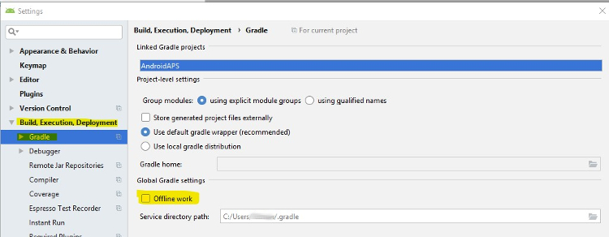

# Update auf eine neue Version oder branch

<b>Wichtiger Hinweis: Ab Version 2.3 muss für das Update git genutzt werden. Ein Update mittels ZIP-File ist nicht mehr möglich.</b>

## Installiere git (falls du es noch nicht hast)

* Jede git Version sollte funktionieren. Beispiel: <https://git-scm.com/download/win>
* Notiere Dir den Installationspfad. Du brauchst diesen im nächsten Schritt.
    
    

* In Android Studio musst Du den Pfad zu git.exe hinterlegen: File - Settings
    
    

* Im nächsten Fenster: Version Control - Git

* Stelle sicher, dass die update method "Merge" ausgewählt ist.
    
    

## Führe ein Update deiner lokalen Version durch

* Klicke: VCS->Git->Fetch
    
    

## Branch auswählen

* Falls du “branch” wechseln willst, wähle eine andere “branch” vom Reiter: master (aktuellste, getestete Version), oder andere (siehe weiter unten).
    
    

und anschließend "checkout". Verwende 'Checkout as New Branch' falls 'Checkout' nicht angezeigt wird.

## Branch-Update von Github

* Drücke Strg+T, wähle Merge method und drücke OK
    
    

Auf dem Reiter siehst du eine grüne Nachricht “updated project”.

## APK erstellen & auf das Smartphone laden

Erstelle die signierte APK wie unter [AndroidAPS installieren - App erstellen (Generate signed APK)](../Installing-AndroidAPS/Building-APK#generate-signed-apk) beschrieben.

Klicke oben rechts auf das Drei-Punkte-Menü und dann den Menüpunkt Über, um auf Deinem Smartphone die installierte AAPS-Version anzuzeigen.

# Problembehandlung

## Kotlin Compiler Warnung

Wenn der Build erfolgreich abgeschlossen wurde, Du aber eine Warnung des 'Kotlin Compilers' erhälst, so kannst Du diese ignorieren.

Die App wurde erfolgreich erstellt und kann auf das Smartphone übertragen werden.

## Could not download… / Offline Work

Falls Du eine Fehlermeldung bekommst, die wie folgt oder ähnlich aussieht

stelle sicher, dass 'offline work' deaktiviert ist.

File -> Settings

## Uncommitted changes

Falls Du eine Fehlermeldung bekommst, die wie folgt oder ähnlich aussieht

### Option 1

* Wähle in Android APS den Menüeintrag VCS -> GIT -> Reset HEAD 

### Option 2

* Kopiere 'git checkout --' in die Zwischenablage (ohne die Anführungszeichen)
* Switch to Terminal in Android Studio (lower left side of Android Studio window) 

* Fügen den Text aus der Zwischenablage ein und drücke Return

## App not installed

* Stelle sicher, dass Du die “app-full-release.apk” auf Dein Smartphone übertragen hast.
* Falls "App not installed" auf dem Smartphone angezeigt wird, gehe wie folgt vor: 
    1. [Exportiere die Einstellungen](../Usage/Objectives#export-import-settings) (in der AAPS Version, die bereits auf Deinem Smartphone installiert ist)
    2. Deintalliere AAPS auf Deinem Smartphone.
    3. Aktiviere den Flugmodus & schalte Bluetooth aus.
    4. Installiere die neue Version ("app-full-release.apk").
    5. [Importiere die Einstellungen](../Usage/Objectives#export-import-settings)
    6. Aktiviere Bluetooth wieder und schalte den Flugmodus aus.

## App installiert, aber weiter die alte Version auf dem Smartphone

Wenn Du die App erfolgreich erstellt, sie auf Dein Smartphone übertragen und dort erfolgreich installiert hast jedoch weiter die alte Versionsnummer angezeigt wird, so hast Du wahrscheinlich den Schritt 'Merge' in der [Update Anleitung](…/Installing-AndroidAPS/Update-to-new-version.html#updating-branch-from-github) übersprungen.

## Keiner der oben genannten Löungsvorschläge funktioniert

Falls die oben genannten Tipps Dich nicht weiter bringen, kannst Du überlegen, die App von Grund auf neu zu erstellen.

1. [Exportiere die Einstellungen](../Usage/Objectives#export-import-settings) (in der AAPS Version, die bereits auf Deinem Smartphone installiert ist)
2. Halte Dein key password und key store password bereit. Falls Du diese vergessen haben solltest, kannst Du sie evtl. wie [hier](https://youtu.be/nS3wxnLgZOo) beschrieben herausfinden.
3. Notiere Dir den key store path. In Android Studio Build -> Generate Signed APK 
    
    4. Erstelle die App von Grund auf neu wie [hier](…/Installing-AndroidAPS/Building-APK.html#download-code-and-additional-components) beschrieben. Use existing key and key store.
4. Nachdem Du die APK erfolgreich erstellt hast, kannst Du die App auf Deinem Smartphone deinstallieren. Übertrage dann die neue APK auf Dein Smartphone und installiere diese.
5. [Importiere die Einstellungen](../Usage/Objectives#export-import-settings)

## Worst case scenario

Falls auch die Neuerstellung der App von Grund auf Dein Problem nicht löst, könntest Du versuchen, Android Studio komplett neu zu installieren. Einige Benutzer berichteten, dass dies ihr Problem gelöst hat.

Stelle sicher, dass Du beim Deinstallieren von Android Studio alle damit in Verbindung stehenden Dateien entfernst. Anleitungen dazu findest Du online z.B. <https://stackoverflow.com/questions/39953495/how-to-completely-uninstall-android-studio-from-windowsv10>.

Install Android Studio from scratch as described [here](/Installing-AndroidAPS/Building-APK#install-android-studio).