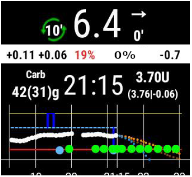

# Циферблаты смарт-часов

AndroidAPS предусматривает возможность *управления* часами Android Wear. Если вы хотите иметь возможность давать болюс с часов, тогда в настройках часов Wear следует включить «Управление с часов».

Следующие функции могут быть запущены с часов:

* установить временные целевые значения СК
* подать болюс
* administer eCarbs
* use the bolus calculator (calculation variables can be defined in [settings](../Configuration/Config-Builder#wear) on the phone)
* check the status of loop and pump
* show TDD (Total daily dose = bolus + basal per day)

Для этого необходимо выбрать вариант сборки "fullRelease" при [построении приложения APK](../Installing-AndroidAPS/Building-APK.md) (или "pumpRelease", который позволяет просто дистанционно управлять помпой без активации цикла). В конфигураторе AndroidAPS при этом нужно [активировать Wear](../Configuration/Config-Builder#wear).

Есть несколько часовых циферблатов на выбор, в которых показывается средняя дельта СК, активный инсулин IOB, действующий временный базал и профили базы и график мониторинга.

Убедитесь, что уведомления от AndroidAPS не заблокированы на часах. Подтверждение действия (например, болюс, временные цели) происходит через уведомления, которые нужно сдвинуть в сторону и нажать на галочку.

Чтобы быстрее попасть в меню AAPS, сделайте двойное нажатие на ГК. При двойном нажатии на кривую ГК можно изменить масштаб времени..

## Устранение неполадок в приложении Wear:

* На Android Wear 2.0 экран часов больше не устанавливается сам собой. Вам нужно зайти в playstore - циферблаты для часов (не путать с Play Market для телефона), и найти его в категории приложений установленных на вашем телефоне, откуда вы можете его активировать. Также включите автообновление. 
* Иногда помогает повторная синхронизация приложений с часами, поскольку этот процесс иногда затягивается: Android Wear > значок шестеренки > наименование часов > повторная синхронизация часов.
* Включите отладку ADB в настройках разработчика (на часах), подключите часы через USB к компьютеру и запустите приложение Wear в Android Studio.

## Циферблат Легенда AndroidAPSv2

О - время с запуска последнего цикла

B - данные ГК мониторинга

C - минуты с последнего получения данных ГК

D - изменение по сравнению с последним полученным значением ГК (в mmol или mg/dl)

E - среднее изменение данных ГК за последние 15 минут

F - состояние аккумулятора телефона

G - скорость подачи базала (в ед/ч во время стандартной подачи и в % при временном базале TBR)

H - BGI (взаимодействие с глюкозой крови) -> Степень, с которой ГК “должна” расти или падать, основываясь только на активности инсулина (без учета других факторов).

I - углеводы (активные углеводы | e-carb в будущем)

J - активный инсулин (от болюсов | от базала)

## Settings

There are different settings to modify and to choose from while using AndroidAPS on your smartwatch:

* Vibrate on Bolus (on | off)
* Units for Actions (mg/dl | mmol/l)
* Show Date (on | off)
* Show IOB (on | off)
* Show COB (on | off)
* Show Delta (on | off)
* Show AvgDelta (on | off)
* Show Phone Battery (on | off)
* Show Rig Battery (on | off)
* Show Basal Rate (on | off)
* Show Loop Status (on | off)
* Show BG (on | off)
* Show Direction Arrow (on | off)
* Show Ago (on | off)
* Dark (on | off)
* Highlight Basals (on | off)
* Chart Timeframe (1 | 2 | 3 | 4 | 5 hours)
* Input Design (Default | Quick righty | Quick lefty | Modern Sparse)
* Delta Granularity (Steampunk) (Low | Medium | High)
* Big Numbers (on | off)
* Ring History (on | off)
* Light Ring History (on | off)
* Animations (on | off)
* Wizard in Menu (on | off)
* Prime in Menu (on | off)
* Single Target (on | off)
* Wizard Percentage (on | off)

## View Nightscout data

If you are using another looping system and want to *view* your looping detail on an Android Wear watch, or want to watch your child's looping, then you can build/download just the NSClient APK. To do this follow the [build APK instructions](../Installing-AndroidAPS/Building-APK.md) selecting the build variant "NSClientRelease". Есть несколько часовых циферблатов на выбор, в которых показывается средняя дельта СК, активный инсулин IOB, действующий временный базал и профили базы и график мониторинга.

## Pebble

Pebble users can use the [Urchin watchface](https://github.com/mddub/urchin-cgm) to *view* looping data (if uploaded to nightscout), but you will not be able to interact with AndroidAPS through the watch. You can choose fields to display such as IOB and currently active temp basal rate and predictions. If open looping you can use [IFTTT](https://ifttt.com/) to create an applet that says if Notification received from AndroidAPS then send either SMS or pushover notification.