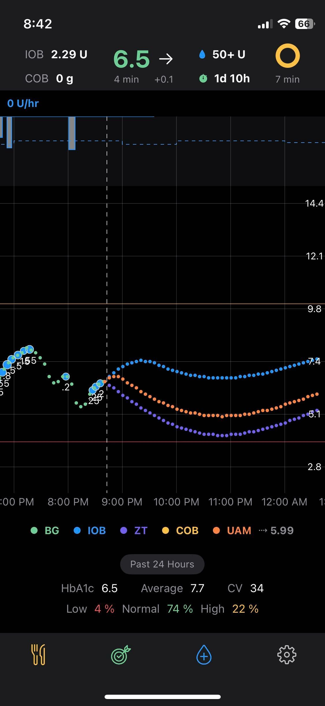
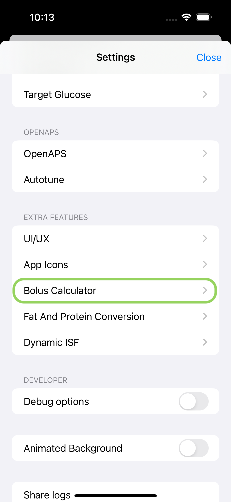
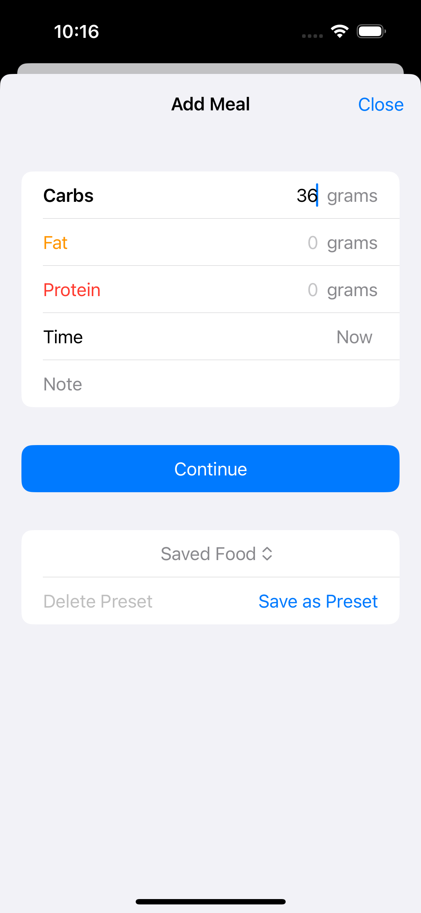
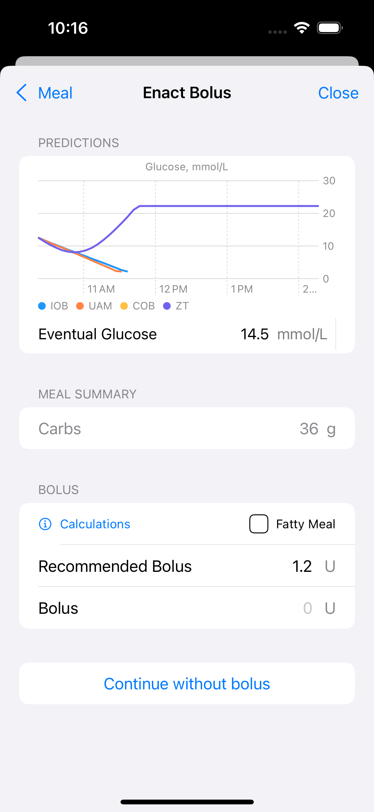
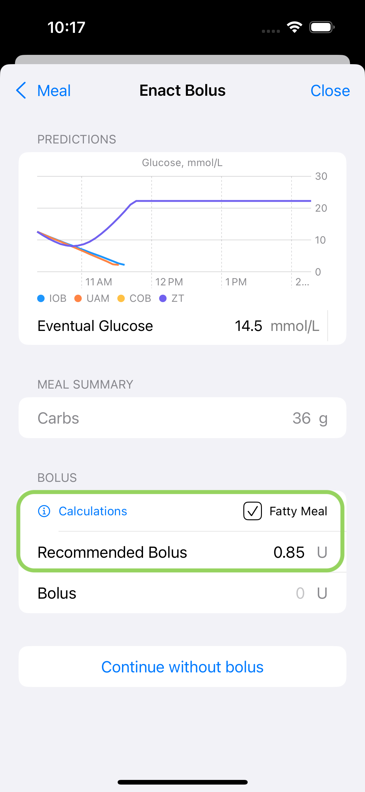
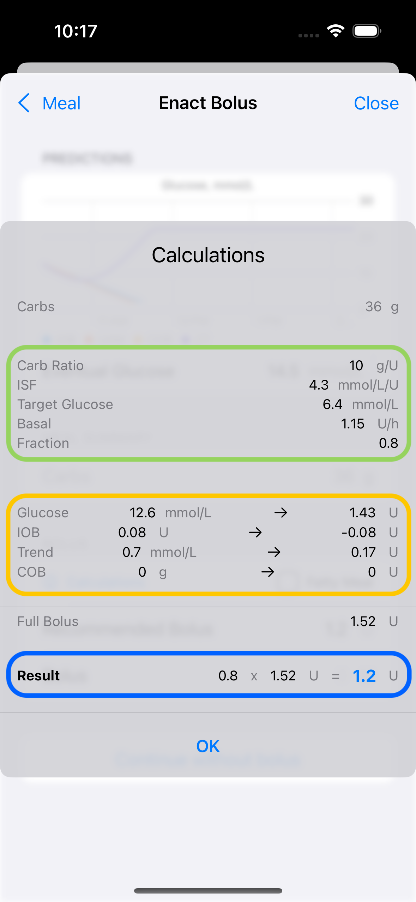
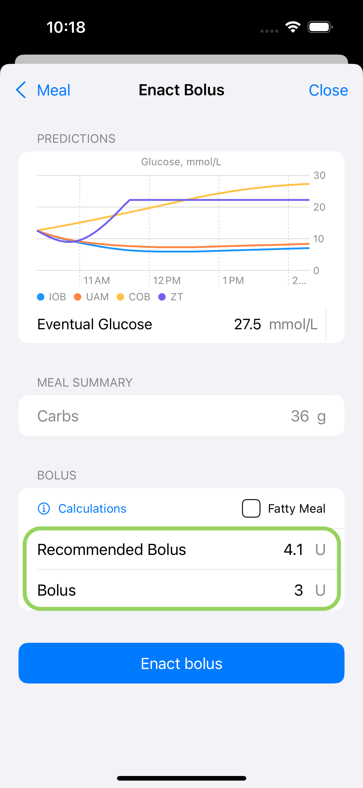

# User Interface

## Main Screen

The main screen of iAPS can be divided into three sections: 

- Status (top)
- Graphs and Statistics (middle)
- Actions (bottom)

### Status
The Status section shows your current insulin on board (IOB), carbs on board (COB), blood glucose, pump status, and looping status. The loop circle will turn yellow if no loop cycle has been completed for over 5 minutes. If more than 10 minutes go by without a successful loop cycle, the loop circle will turn red. The section to the left of the loop circle shows you approximate units of insulin left in your pump. If you're using Omnipod, 50+ U means there is more than 50 units of insulin left. Below the insulin left, you will see your pump battery status if you're using a Medtronic pump and the days/hours left if you're using an Omnipod.

Tapping the top of the screen will bring up a History screen with information on changes implemented by the most recent loop cycle. Tapping the pump status will bring you to pump settings.

### Graphs and Statistics
The middle of the screen graphs your current blood sugar data and inputted carbs overlaid with iAPS's insulin delivery and blood sugar predictions.

The zero temp (ZT) line predicts where your blood sugar would be if insulin delivery and carb absorption were ceased. The IOB line predicts where blood sugar would be if insulin delivery was ceased and carb absorption was minimal. The unannounced meal (UAM) line predicts how long blood glucose will continue to rise, to dose insulin accordingly. For more information on prediction lines, see the [OpenAPS documentation.](https://openaps.readthedocs.io/en/latest/docs/While%20You%20Wait%20For%20Gear/Understand-determine-basal.html)

If enabled, statistics are displayed underneath these graphs detailing your time in range, coefficient of variance (CV) and average glucose. Tapping in this area allows you to change the time interval used to calculate these statistics.

### Actions
At the bottom of the screen, you have four action icons:

- Meal bolus
- Temp Targets
- Correction Bolus
- Statistics
- Settings

The left icon is the meal bolus option which allows you to enter Carbs and bolus accordingly. If you have "Fat And Protein Conversion" enabled, you will also be provided the option to enter fat and protein content in grams.

The target icon allows you to set temporary targets. Most common targets are a high target for exercise, and a low target in preparation for meals. 

The insulin drop icon allows you to give manual correction boluses. Manually correcting is not recommended if you are using iAPS's SMB and UAM features.

The rightmost icon allows you to access your iAPS settings. The settings screen allows you to adjust your configuration. Please see [Configure](../settings/devices/pump.md) for more information on each configuration option.

## New Bolus Calculator
It's hard to manually calculate the right bolus for a meal. The carbs you eat are one thing, but to get the right bolus you also need to consider carbs and insulin already on board, current glucose value and where your glucose is heading. If glucose is heading low, should you still bolus, or wait? All of these considerations have been part of the bolus calculator for a while, but it has still raised lots of questions. Because of that, a new bolus calculator has been developed by one of the community members and it has been refined and tested by several users. As of November 28th 2023 it is still in the DEV branch of iAPS, but it will soon be added to the Main branch and available for everyone to use.

### How to activate the new Bolus Calculator
The new bolus calculator is not enabled by default. You need to go into Settings -> Bolus Calculator and activate it:

When you activate it you will see some new settings turn up. The intended behaviour of any APS based system is to bolus a partial amount up-front and then let SMB's handle the rest depending on your BG development. Read the explanation in the bolus calculator settings and then set your override factors. If you are using an iPhone with a small or low resolution display, you could consider disabling the prediction lines in the calculator by turning off "Display Predictions".

### How to use the new Bolus Calculator

Start by tapping the fork and knife icon. Select a preset meal or enter carbs (and fat and protein if you want). Tap Continue and the new bolus calculator will open.

The new bolus calculator will open and it will show you three things:

1. Your current prediction lines
2. A meal summary of the carbs (and fat and protein) you just entered
3. A bolus recommendation

If you tap "Fatty meal" you will see that the bolus recommendation changes according to the override factors you've set up in settings.

If you tap "Calculations" you will see how iAPS has come up with the bolus recommendation:

1. The amount of carbs entered
2. In the green circle, you will see the relevant profile or dynamic settings: Carb Ratio, ISF, Target Glucose, Basal and fraction/override.
3. In the orange circle, you will see the relevant current values: Glucose, IOB, Glucose Trend, and COB. You will also see how each of these values affect the outcome of the recommendation. In this screenshot, current glucose is a bit high (12.6 mmol/L or 226 mg/dl) and that leads to an extra 1,43 Units of insulin into the calculation. The current IOB removes 0,08U and the BG trend adds 0,17U.
4. In the blue circle, you will see the result of the calculation, including the fraction/override you've set up in settings.

Tap "OK" to close the calculation pop-up.

Back in the bolus calculator screen you can now choose the next action:

1. (Tap "Meal" to go back and edit the meal entry) <b>Not implemented yet.</b>
2. Tap "Close" to close the calculator. The meal entry will be discarded and deleted. It will also be removed from Nightscout and Apple Health if you are using those services.
3. Tap "Continue without bolus" if you want to save the meal entry but you don't want to bolus.
4. Tap on the "Recommended Bolus" amount to add it as Bolus amount. Finally, tap "Enact Bolus".

If you want to manually override the Bolus amount, you can tap "Bolus" to change it. Only the amount in the "Bolus" field will be enacted.

